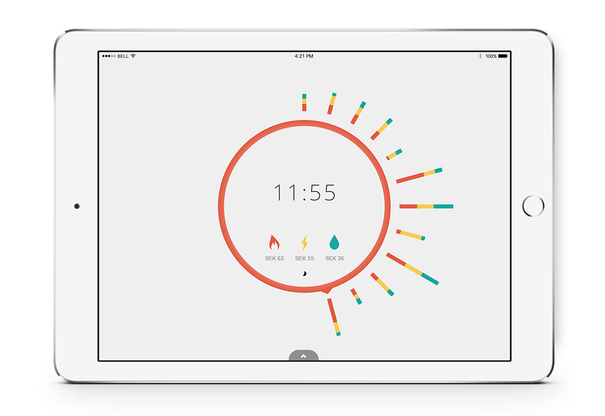

## NVISION

The egineering agency Nspyre's big data unit was looking for a visualization
framework to provide customers with customized and branded visualization
dashboards.

As I had previous experience with visualization design, Nspyre hired me as an
intern as part of my master thesis project to design this data visualization
framework. I created a web-based app called Nvision based on Angular and D3 that
allows users to create and customize their own visualization-dashboard.

Through iterative user-testing the product was refined, and consequently it was
used to conduct an experimental user study with 184 participants. I tried to
find out whether exposing users to the plumbing of an application (the green
arrow in the image) would help them create a representative mental model and
work more efficiently. You can play with the study setup using this
[this link](https://henrilouis.com/webprojects/nspyre/nvision/).

The result was interesting as I found the opposite; participants in the
condition without exposed plumbing (or information flows as I've called them)
performed worse. My hunch is that exposing especially novices to more stimuli
will increase cognitive load and make them perform worse on the already complex
task. Another reason to keep products simple and clean, good design seems to be
invisible.

## iBrowse

This Chrome Plugin simplifies and enhances the experience of searching Chrome’s
browsing history. Browsing behavior is visualized as a calendar heat-map,
showing on which days what websites are visited. When entering a search term the
corresponding days are highlighted, so you can quickly find that website you
visited the other day.

The application also shows you interesting statistics about how, when and how
often you browse the web. Try finding your own patterns and enjoy exploring your
history.

Created in collaboration with Wouter Jansen and Ivo van Bon. You can find it in
the
[Chrome Webstore](https://chrome.google.com/webstore/detail/ibrowse/hcjpbkigjdnnpjmhgjnficbpkjgbmnek)
and here's a link to the
[Repository on Github](https://github.com/henrilouis/ibrowse).

## Energy clock

Created in collaboration with Wouter Jansen and Ivo van Bon, this project was
started as part of a cooperation between the energy company Fortum, and the KTH
Stockholm. The goal was creating awareness of energy consumption among the
general population through an ambient display in the living room. You can play
with the [prototype here](http://henrilouis.com/webprojects/kth/vis/energy/) and
here's a link to the
[Repository on Github](https://github.com/henrilouis/energy)

The energy clock visualizes energy consumption data of an average household to
create this awareness. By touching the bars, the user can change between
different visual styles. The different types of energy can be toggled by
touching their respective icons.

Finally when touching the time, the user can explore the energy consumption
history. This visualization is best displayed on an iPad and was created for
this type of device.

