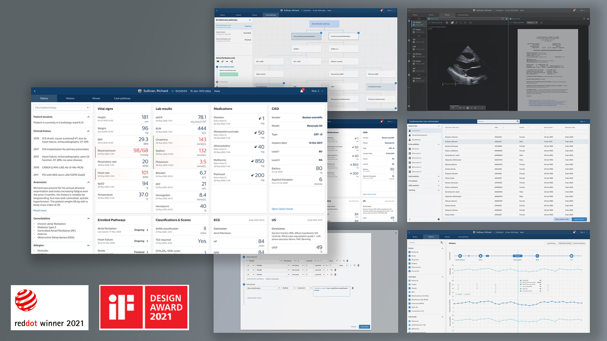
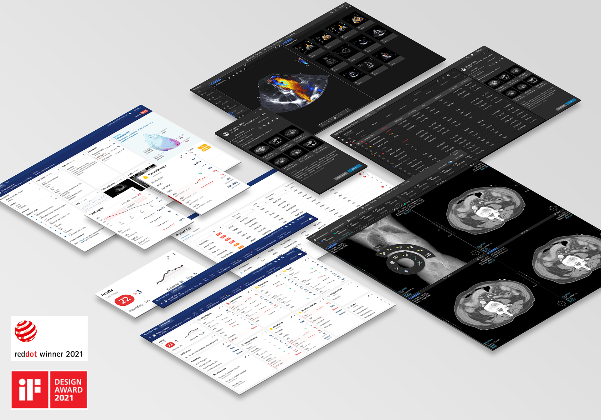
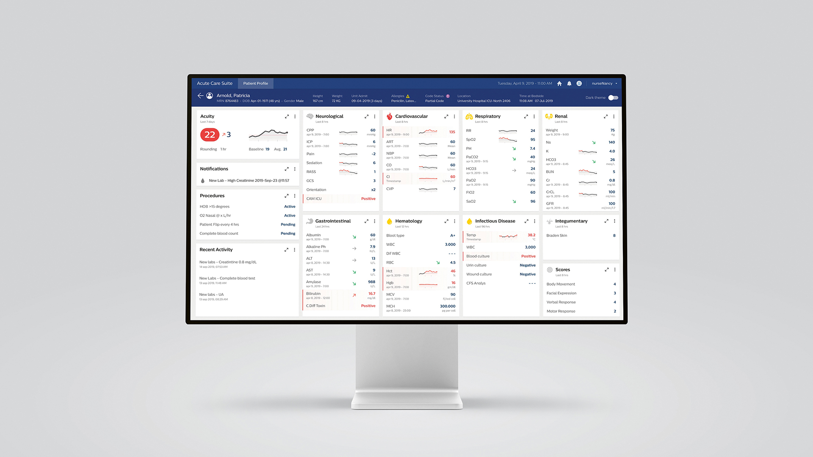
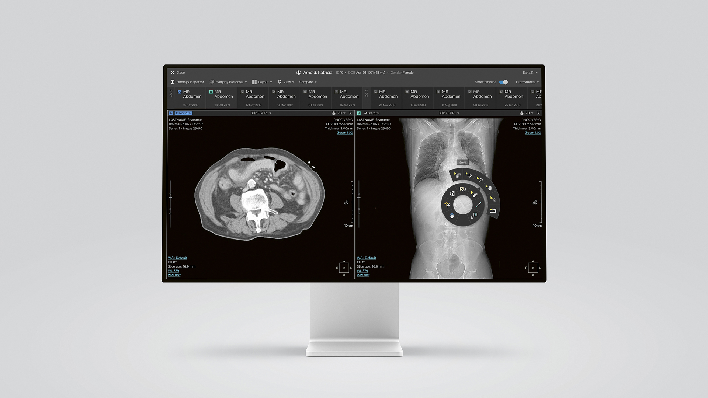

## My role and responsibilities

- Lead design teams for the cardiology informatics and enterprise diagnostic
  informatics business, creating a diagnostic software platform for healthcare
  providers.
- Create and validate product visions with users and stakeholders.
- Define and create high level design modules to harmonize within Philips.
- Contribute to Philips' design system (DLS) and maintain a CSS toolkit.

Most projects are confidential, but the few I can metion and link to are
mentioned below.

## Challenges for software in healthcare

The state of software user experiences is healthcare is not something to write
home about. Software usability issues are a contributing factor to physician
burn-out. Many clinicians feel like glorified data entry clerks due to
regulatory requirements and the lack of interoperability between systems:
duplicate data entry.

What makes this market interesting is the lack of competition as compared to
consumer products: these products are bought during large tender deals that span
multiple years, reducing competition to a small window in time. The products are
complex while serving smaller niches in healthcare, leading them to mostly
compete on features, trying to catch up to the competition, leaving little room
to make the experience better.

## Vision

By applying **user centered design** we create large improvements to the status
quo. We make experiences that delight the clinician while solving their problems
with as little friction as possible. This allows clinicians to focus on the
patient, not the software.

An applied example is Cardiovascular care orchestrator: a suite of applications
to help a cardiologist get an understanding of the patient to help with decision
making. The design has received both a
[red-dot](https://www.red-dot.org/project/cardiovascular-care-orchestrator-55426)
and
[iF](https://ifdesign.com/en/winner-ranking/project/cardiovascular-care-orchestrator/301044)
award and is being developed as we speak.

Healthcare software is complex and creating it requires deep understanding of
the workflow. To be able to de-risk the experience before we invest in
development and go-to-market, we use **low and high fidelity prototypes** that
are evaluated and iterated on with users. Low fidelity to understand the needs,
high fidelity to nail the details. In my view this is the only way we get to the
user experience quality healthcare providers deserve.

To be able to provide this in an environment where competition is still largely
on features we create **modular experiences** that can be re-used among multiple
similar products. This allows for a more unified experience, increased
opportunity for validation, and a more efficient implementation. The approach
was also selected for red-dot and iF design awards.

