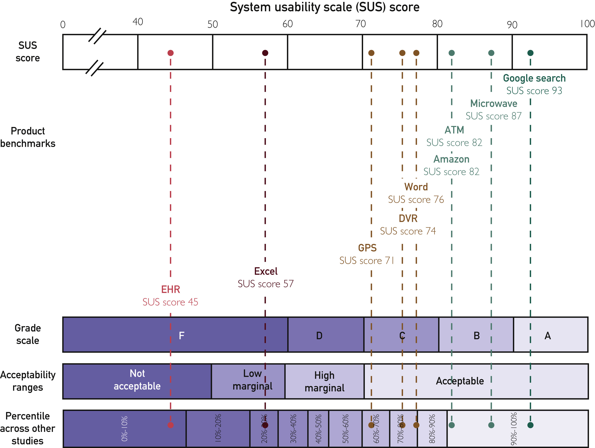

---

title: 'Philips Experience Design' 
date: '2021-09-01' 
hero_image: './philips_hololens.jpg' 
hero_image_alt: 'Philips Experience Design' 
thumbnail: './philips_hololens.jpg' 
summary: "As a design lead at Philips I've been working
with amazing clinicians, designers, engineers and others to create digital
products and services for healthcare practitioners."

---

## My role and responsibilities

- Lead design teams for the cardiology informatics and enterprise diagnostic
  informatics business unit, creating a diagnostic software platform for
  healthcare providers.
- Review team design work and lead agile ceremonies.
- Act as the UX advocate and representative within the businesses unit.
- Define design principles and create product vision with users and
  stakeholders.
- Define and create high level design modules to harmonize within Philips.
- Contribute to Philips' design system (DLS) and maintain various toolkits.

Most projects are confidential, but the few I can mention are shown below.

---

## Challenges for software in healthcare

The state of software user experiences is healthcare is not something to write
home about. Software usability issues in Electronic Health Record (EHR) systems
are found to be a contributing factor to physician burn-out
[(Melnick. E.R. et al., 2020)](https://www.sciencedirect.com/science/article/pii/S0025619619308365#!).
This is not striking if we look at the average System Usability Scale score for
EHR's compared to those of other benchmark products.

Many clinicians feel like glorified data entry clerks due to regulatory
requirements and the lack of interoperability (connectivity) between systems
from different vendors leads to the wasteful activity of duplicate data entry.
There's a lot to be improved by working together and integrating data.

The competitive landscape is very different compared to consumer products. The
products are complex and the cost of meeting regulatory requirements is large,
setting a high bar to enter the market. Healthcare products are bought during
large tender deals that span multiple years, reducing competition to a small
window in time. During these tenders there's a tendancy to compare products on
features while decision makers are often not the users. This lead the vendors to
compete on features, trying to catch up to the competition, leaving little room
to make the experience better. This als means there's an opportunity to
differentiate by making products with a truly great user experience.

---

## Approach

By applying **user centered design** we create large improvements to the status
quo. We make experiences that delight the clinician while solving their problems
with as little friction as possible. This allows clinicians to focus on the
patient, not the software.

An applied example is Cardiovascular care orchestrator: a suite of applications
to help cardiologists get an understanding of the patient to speed up the review
process and assist in decision making. The design has received both a
[Red Dot](https://www.red-dot.org/project/cardiovascular-care-orchestrator-55426)
and
[iF](https://ifdesign.com/en/winner-ranking/project/cardiovascular-care-orchestrator/301044)
award and is being implemented.

Healthcare software is complex and creating it requires deep understanding of
the workflow. This means we engage in lots of research and observation before we
even ideate on product ideas. To be able to de-risk the experience before we
invest in development and go-to-market, we use **low and high fidelity
prototypes** that are evaluated and iterated on with users. Low fidelity to
verify the needs and proposition, high fidelity to nail the details. In my view
this is the only way we get to the user experience quality healthcare providers
deserve.

To be able to provide this in an environment where competition is still largely
on features we create **modular experiences** that can be re-used among multiple
similar products. These sit as blueprint application designs on top of the
design system. This allows for a more unified experience, increased opportunity
for evaluation, and a more efficient implementation.

The approach was also selected for
[Red Dot](https://www.red-dot.org/project/modular-healthcare-informatics-user-interface-system-49274)
and
[iF design](https://ifdesign.com/en/winner-ranking/project/modular-design-approach/273175)
awards.
