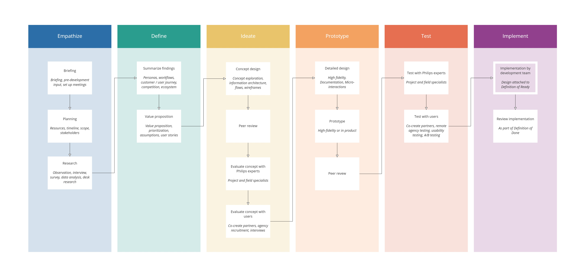

## Design principles

### User and business goals at the center

Holding these central leads to profitable products that make users happy.

### Function and form

A product's primary purpose is to allow the user to accomplish a goal easy and
without friction. Beautiful esthetics can then be applied to delight the user.

### Less, but better

Great products solve problems in simple, clear and focused ways without adding
unnecessary features.

---

## Process in my current team

Our team works as a separate team close to the business. We use a form of agile
scrum for project management. We align and review design work to make sure our
decisions are consistent. Each designer is responsible for a product and hosts
formal reviews with the product team. This includes the Product Manger, Product
Owner, Subject Matter Expert, Architect and Lead Engineer for the product.

Our design process is close to design thinking (buzzword alert): iteratively
learning how to best solve a certain problem. We apply design as the scientific
method for business, allowing early and rigurous de-risking before going to
market with a product.

We move through the first five phases iteratively with the product teams to get
to a degree of certainty and common understanding before the engineering team
starts on the implementation. If the code base allows it we prototype there
instead and the last phase will be enabling the feature for customers, however
often a rigorous pre-development is still required for a new product.
