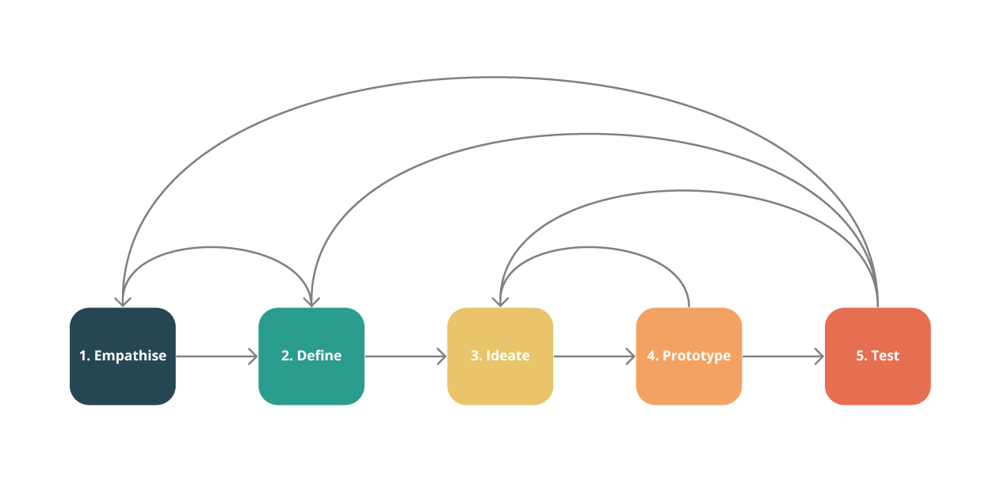

## Design principles

### User and business goals

Building on user and business goals leads to profitable products that make users
happy.

### Form follows function

A product's primary task is to allow the user to accomplish his or her task as
easy as possible. I marry the rigt balance between function and esthetics to
make the experience enjoyable while not distracting from the task.

### Occam's razor

The simplest solution almost always is the best. Getting to this is hard, but
it's worth the effort.

## Design thinking

Design thinking, although a buzzword, does describe the way I approach design,
iteratively increasing understanding of how to solve a certain problem.

Design in this way acts as the scientific method for business, allowing early
and rigurous de-risking before going to market with a product.
