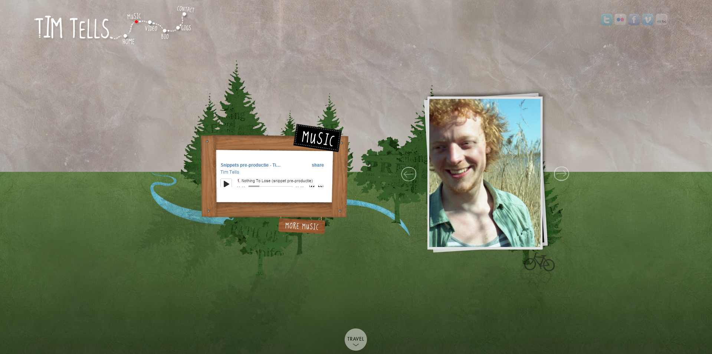
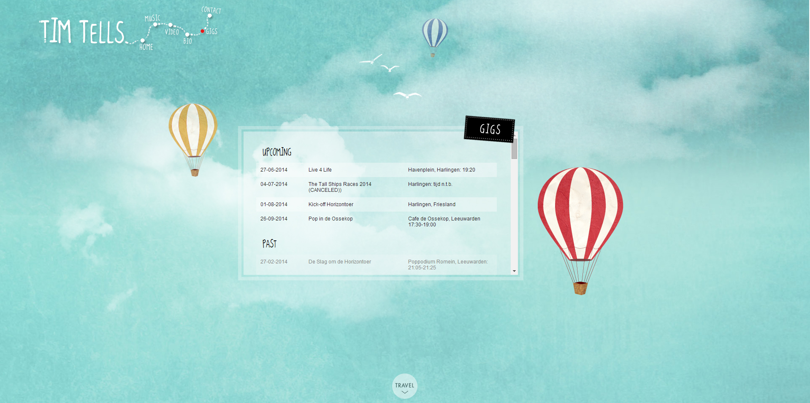
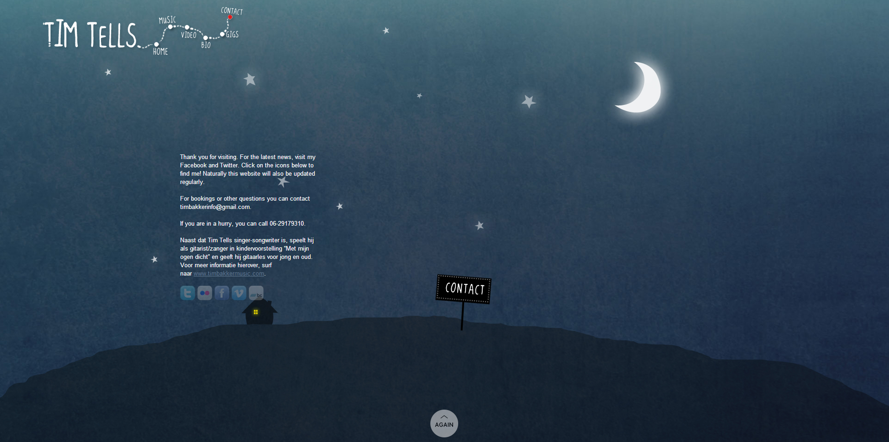
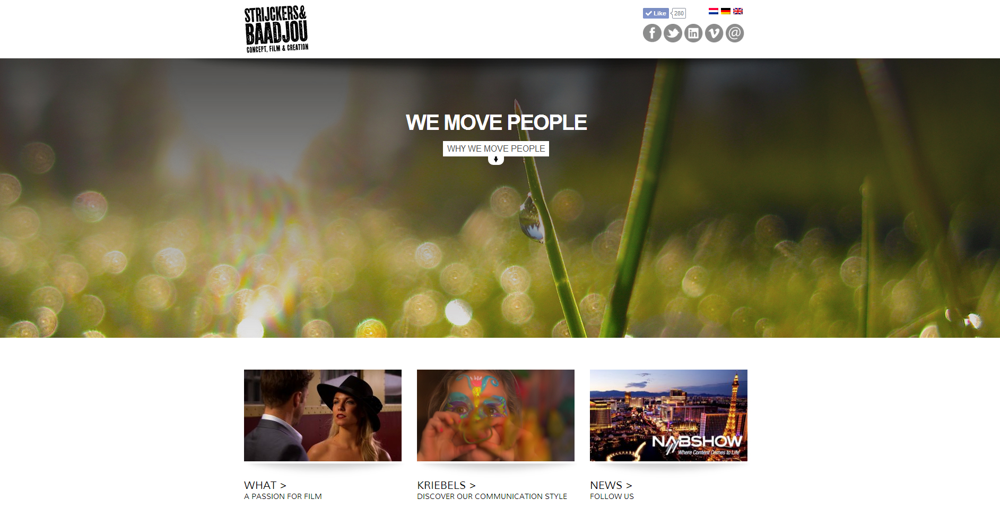
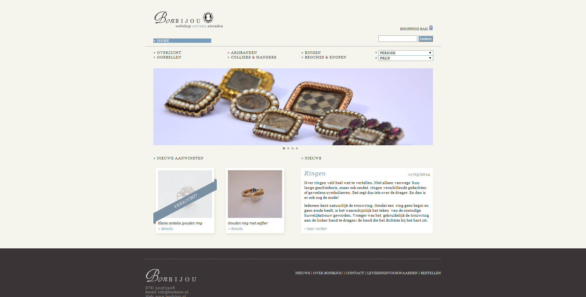
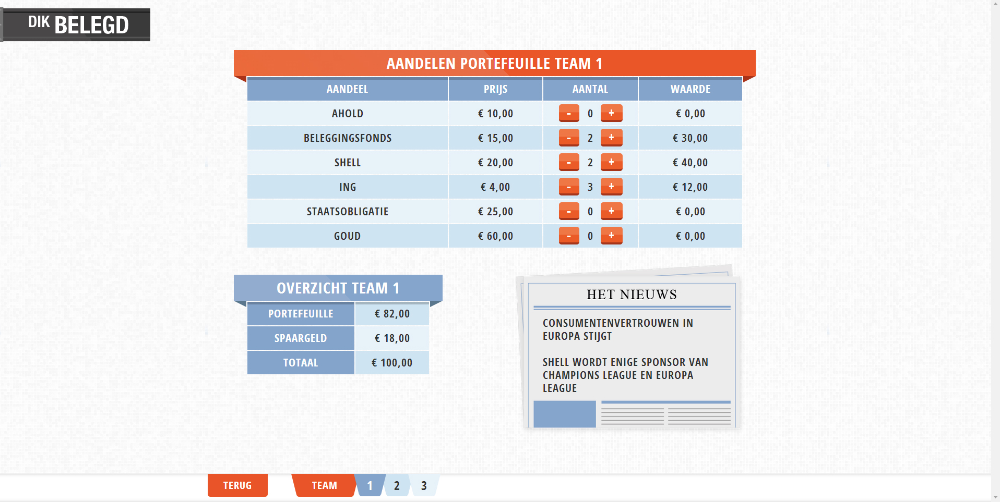
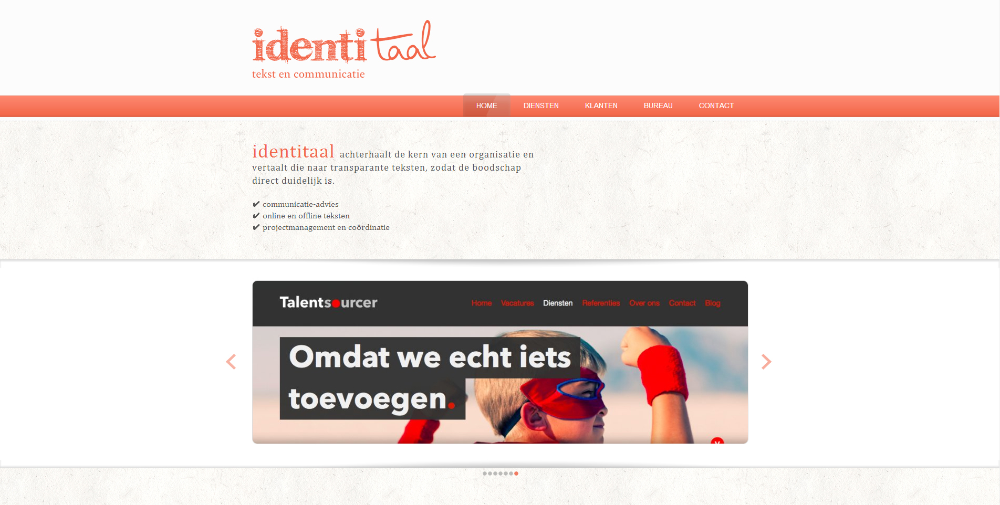
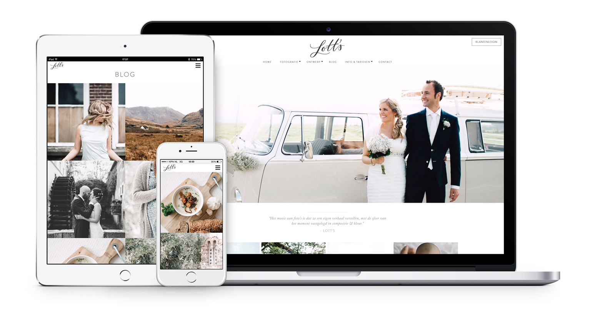
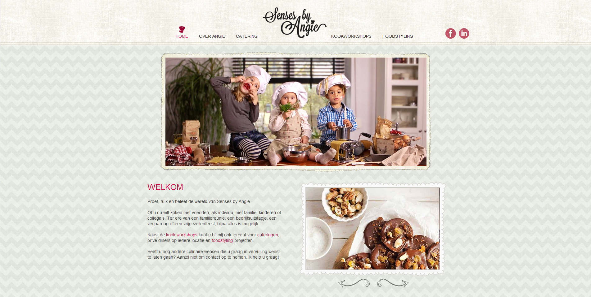
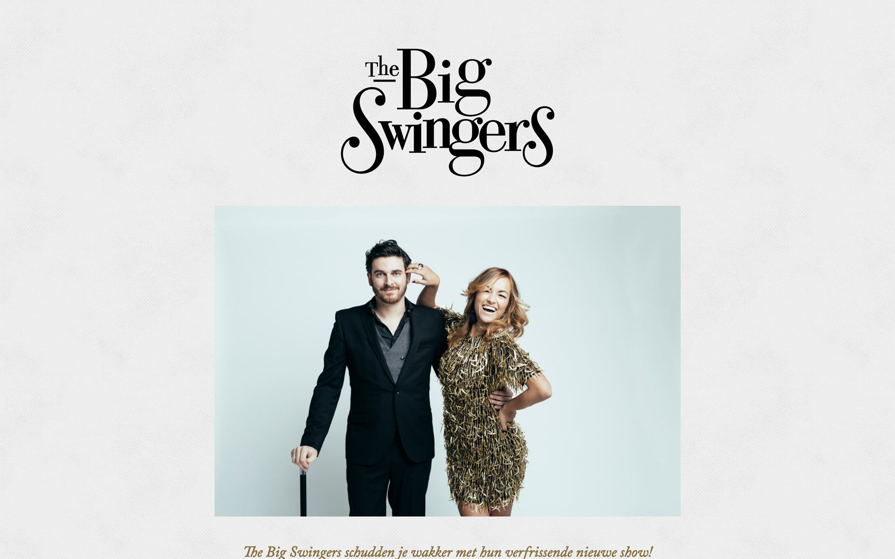

Web design keeps me grounded in new trends from a design and development
perspective, while providing me the satisfaction of bringing a concept from idea
to implementation. Here are a few web projects I've implemented for customers.

Most of these are Wordpress website where I've created the theme and made all
the fields customizable by the customer.

## Tim tells

Musician Tim Bakker aimed to translate his personality and musical ideas into a
website.

## Baadjou

Creative agency website

## Bonbijou

A webshop for vintage jewelery.

## Dik belegd

A class-room game to teach students about investing and market effects. Used on
a beamer or digital whiteboard.

## Identitaal

Identitaal communication agency website.

## Lotts

Lotts photography portfolio website.

## Senses by angie

## Slagerij Hurks

## The big swingers

